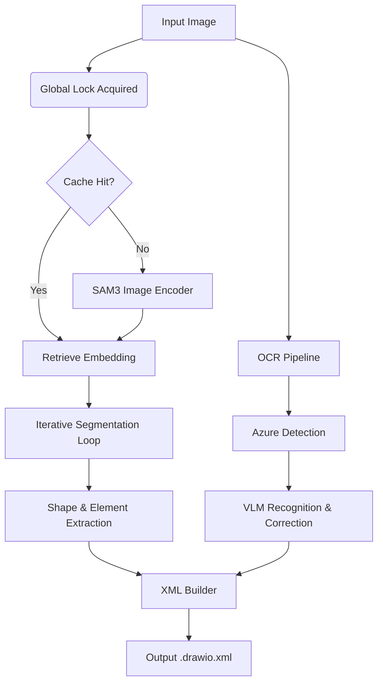

# Technical Report: Image to DrawIO Conversion System

## 1. Executive Summary

This system translates raster images (JPG, PNG) of diagrams into editable vector graphics (DrawIO XML). It overcomes the limitations of traditional OCR and simple edge detection by integrating **State-of-the-Art Vision Models (SAM 3)** for segmentation and **Multimodal Large Language Models (VLM)** for semantic understanding and text correction.

## 2. System Architecture

The pipeline consists of three main stages: **Segmentation**, **Text Extraction**, and **Integration**.

### 2.1 Core Components

*   **Segmentation Engine**: SAM 3 (Segment Anything Model 3).
*   **OCR Engine**: Hybrid (Azure Document Intelligence + Qwen/Mistral VLM).
*   **Background Removal**: RMBG-2.0 (Bi-RefNet based).
*   **Orchestration**: Python (FastAPI + Asyncio) with Thread-safe Global Locking.

## 3. Key Algorithmic Innovations

### 3.1 Iterative VLM-Guided Segmentation
Instead of relying on a fixed set of prompts, the system uses a feedback loop:
1.  **Round 1**: SAM3 segments objects using generic prompts (`rectangle`, `icon`, `arrow`).
2.  **Visualization**: A mask overlay is generated showing what has been detected.
3.  **VLM Inference**: The VLM views the visualization and the original image, identifying "missed" regions.
4.  **Prompt Generation**: The VLM suggests new specific prompts (e.g., "cylinder", "actor").
5.  **Incremental Decoding**: SAM3 decodes only the new prompts using the cached image embedding, merging results via NMS (Non-Maximum Suppression).

### 3.2 Hybrid OCR with Hallucination Control
Pure VLM OCR often "hallucinates" text processing instructions or reads text from outside the crop. Pure Azure OCR fails on LaTeX.
**Solution**:
1.  **Detection**: Azure provides tight bounding boxes.
2.  **Hint Injection**: The Azure-detected text is passed to the VLM system prompt: *"Hint: The text might be close to 'detected_text'. Only correct it if necessary."*
3.  **Constraint**: This anchors the VLM's generation, allowing it to fix typos or format LaTeX without inventing content.

### 3.3 Rate Limit Management (The "429" Solution)
Processing a diagram with 50+ detect text blocks can instantly trigger API rate limits.
**Optimization**:
*   **Batching**: Crops are grouped into batches of 5.
*   **Exponential Backoff**: If a 429 occurs, the thread sleeps for $2^n \times 2$ seconds.
*   **Pacing**: A baseline delay (3s) is added between batches to smooth out the request curve.

### 3.4 Smart Color Extraction
Simple partial pixel averaging fails when elements have borders or noise.
**Algorithm**:
1.  **Stroke Color**: Analyzes the outer 10% margin of the bounding box. It computes the luminance of these pixels and takes the mean of the **darkest 25%**, assuming borders are darker than the background.
2.  **Fill Color**: Shrinks the ROI by 20% to exclude borders and calculates the **Median** pixel value (more robust to noise/text than Mean).

### 3.5 High-Fidelity Arrow Routing
Arrows in diagrams often curve or have dashed styles that are hard to vectorize perfectly.
**Approach**: We extract arrows as **Transparent Images** rather than vector paths.
1.  **Crop**: Cut a padded region around the arrow.
2.  **Mask-Guided Filtering**: Use the SAM3 mask to "white out" neighboring elements (text, other shapes) from the crop.
3.  **RMBG**: Remove the white background, leaving only the arrow.
This ensures the visual representation is 100% accurate to the original.

## 4. Performance Optimization

*   **LRU Cache for SAM3**: High-resolution image encoding takes time. We cache the `ImageEmbedding` tensor in an `OrderedDict` (size=3). Switching between recently edited images is instantaneous.
*   **Concurrency Control**: A `threading.Lock` wraps all GPU operations. This allows the HTTP server to accept concurrent requests without OOM (Out of Memory) crashes on a single GPU.

## 5. Deployment & Configuration

The system is designed to be modular.
*   **Config**: `config/config.yaml` controls model paths and prompts.
*   **Environment**: `.env` handles secrets.
*   **Frontend**: React-based, allowing users to upload, process, and instantly open the result in an embedded DrawIO editor.

---
*Generated by GitHub Copilot on 2026-01-16*
